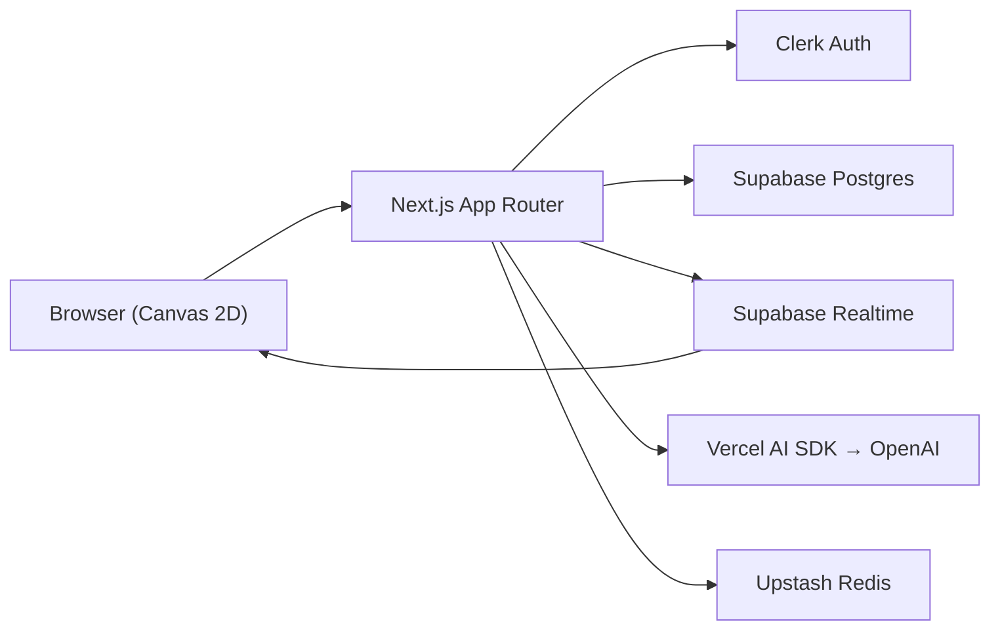

# CollabBoard

Real-time collaborative whiteboard for distributed teams — draw, diagram, and brainstorm together with AI assistance.

## Why CollabBoard

Remote teams need visual collaboration tools that feel as natural as a physical whiteboard. CollabBoard combines real-time multi-user canvas editing with AI-powered commands that generate and arrange objects from natural language. Built as a reference implementation using the Gauntlet meta-workflow system.

## Features

- **Real-time collaboration** — Multiple users draw and edit on the same board simultaneously via Supabase Realtime Broadcast
- **Canvas-based rendering** — Smooth 2D canvas with pan, zoom, and selection at 60fps
- **Rich object types** — Sticky notes, text, shapes (rectangle, ellipse, diamond, triangle), freehand drawing, connectors, frames
- **AI-powered commands** — Natural language commands (via `/` key) to generate and arrange board objects
- **Undo/Redo** — Full command-pattern history with Ctrl+Z / Ctrl+Shift+Z
- **Copy/Paste/Duplicate** — Internal clipboard with Ctrl+C, Ctrl+V, Ctrl+D
- **Board sharing** — Generate view/edit share links with token-based access
- **Property editing** — Color, size, and style controls for selected objects
- **Presence indicators** — See who else is on the board in real-time
- **Keyboard shortcuts** — Comprehensive shortcuts for all tools and actions
- **Loading skeletons** — Smooth Suspense-based loading states
- **Toast notifications** — Non-intrusive feedback for user actions

## Tech Stack

| Layer         | Technology                            |
| ------------- | ------------------------------------- |
| Framework     | Next.js 14 (App Router)               |
| Auth          | Clerk                                 |
| Database      | Supabase (Postgres + RLS)             |
| Real-time     | Supabase Realtime Broadcast           |
| Rate Limiting | Upstash Redis                         |
| Styling       | Tailwind CSS 3                        |
| Rendering     | Canvas 2D API                         |
| AI            | Vercel AI SDK + OpenAI GPT-4o-mini    |
| Observability | LangFuse (instrumentation)            |
| Testing       | Vitest + Testing Library + Playwright |
| Monorepo      | pnpm workspaces + Turborepo           |

## Architecture

### System Overview



### Key Design Decisions

- **Canvas 2D over SVG/DOM** — Performance at scale; hundreds of objects without layout thrashing
- **Supabase Realtime Broadcast over Postgres Changes** — Lower latency for cursor and object sync
- **Last-Write-Wins over CRDTs** — Simpler conflict resolution, sufficient for target concurrency
- **Command pattern for undo/redo** — Full operation history, composable and serializable
- **Optimistic updates** — Render immediately, confirm asynchronously

### Performance Targets

| Metric           | Target       |
| ---------------- | ------------ |
| Cursor sync      | p95 < 50ms   |
| Object sync      | p95 < 100ms  |
| Canvas FPS       | 60 steady    |
| Concurrent users | 5+ per board |
| Page load (LCP)  | < 3s on 4G   |

## Getting Started

### Prerequisites

- Node.js 20+
- pnpm 9+
- Supabase CLI + project (local or cloud)
- Clerk account
- OpenAI API key

### Setup

```bash
# Clone and install
git clone https://github.com/AaronCarney/collabboard
cd collabboard
pnpm install

# Configure environment
cp .env.example .env.local
# Fill in your Clerk, Supabase, and AI provider credentials

# Run database migrations
pnpm supabase db push

# Start development server
pnpm dev
```

### Environment Variables

| Variable                            | Description                                        |
| ----------------------------------- | -------------------------------------------------- |
| `NEXT_PUBLIC_APP_URL`               | Application URL (default: `http://localhost:3000`) |
| `NEXT_PUBLIC_CLERK_PUBLISHABLE_KEY` | Clerk publishable key                              |
| `CLERK_SECRET_KEY`                  | Clerk secret key                                   |
| `CLERK_WEBHOOK_SECRET`              | Clerk webhook signing secret                       |
| `NEXT_PUBLIC_CLERK_SIGN_IN_URL`     | Sign-in page path                                  |
| `NEXT_PUBLIC_CLERK_SIGN_UP_URL`     | Sign-up page path                                  |
| `NEXT_PUBLIC_SUPABASE_URL`          | Supabase project URL                               |
| `NEXT_PUBLIC_SUPABASE_ANON_KEY`     | Supabase anon/public key                           |
| `SUPABASE_SERVICE_ROLE_KEY`         | Supabase service role key (server-only)            |
| `DATABASE_URL`                      | Direct Postgres connection string (pooler)         |
| `OPENAI_API_KEY`                    | OpenAI API key for AI commands                     |
| `UPSTASH_REDIS_REST_URL`            | Upstash Redis REST URL                             |
| `UPSTASH_REDIS_REST_TOKEN`          | Upstash Redis REST token                           |
| `NEXT_PUBLIC_DEBUG_REALTIME`        | Enable verbose Realtime logging (optional)         |

## Development

### Commands

| Command              | Description                               |
| -------------------- | ----------------------------------------- |
| `pnpm dev`           | Start dev server (all apps via Turborepo) |
| `pnpm build`         | Production build                          |
| `pnpm typecheck`     | TypeScript strict check                   |
| `pnpm lint`          | ESLint                                    |
| `pnpm lint:fix`      | ESLint with autofix                       |
| `pnpm test`          | Unit and integration tests (Vitest)       |
| `pnpm test:watch`    | Watch mode                                |
| `pnpm test:coverage` | Coverage report                           |
| `pnpm test:e2e`      | Playwright E2E tests                      |
| `pnpm test:load`     | k6 WebSocket load tests                   |
| `pnpm test:packages` | Run tests across all packages             |

## Project Structure

```
collabboard/
├── apps/
│   └── web/                    # Next.js application
│       └── src/
│           ├── app/            # App Router pages
│           │   ├── board/      # Board editor page
│           │   ├── dashboard/  # Board listing page
│           │   └── api/        # API routes (AI, sharing)
│           ├── components/
│           │   └── board/      # Board UI components
│           ├── hooks/          # Custom React hooks
│           └── lib/            # Core logic (store, keyboard, transforms)
├── packages/
│   ├── db/                     # Supabase client factory + generated types
│   ├── shared/                 # Zod schemas, shared types, constants
│   └── ui/                     # Shared React components
├── supabase/                   # Database migrations + RLS policies
├── e2e/                        # Playwright E2E tests
├── load-tests/                 # k6 WebSocket load tests
└── docs/                       # Architecture, specs, plans
```

## Testing

2,000+ unit/integration test cases across 7 E2E spec files, plus k6 load tests covering WebSocket sync under concurrency.

- **Unit tests:** Component rendering, store logic, hook behavior, schema validation
- **Integration tests:** API routes, database operations, real-time sync flows
- **E2E tests:** Full user journeys — board creation, drawing, collaboration, sharing
- **Load tests:** WebSocket connection scaling and broadcast latency under load

## Documentation

| Document                                     | Purpose                            |
| -------------------------------------------- | ---------------------------------- |
| [docs/architecture.md](docs/architecture.md) | Detailed system architecture       |
| [docs/plans/](docs/plans/)                   | Implementation plans               |
| [CLAUDE.md](CLAUDE.md)                       | AI agent context and project rules |
